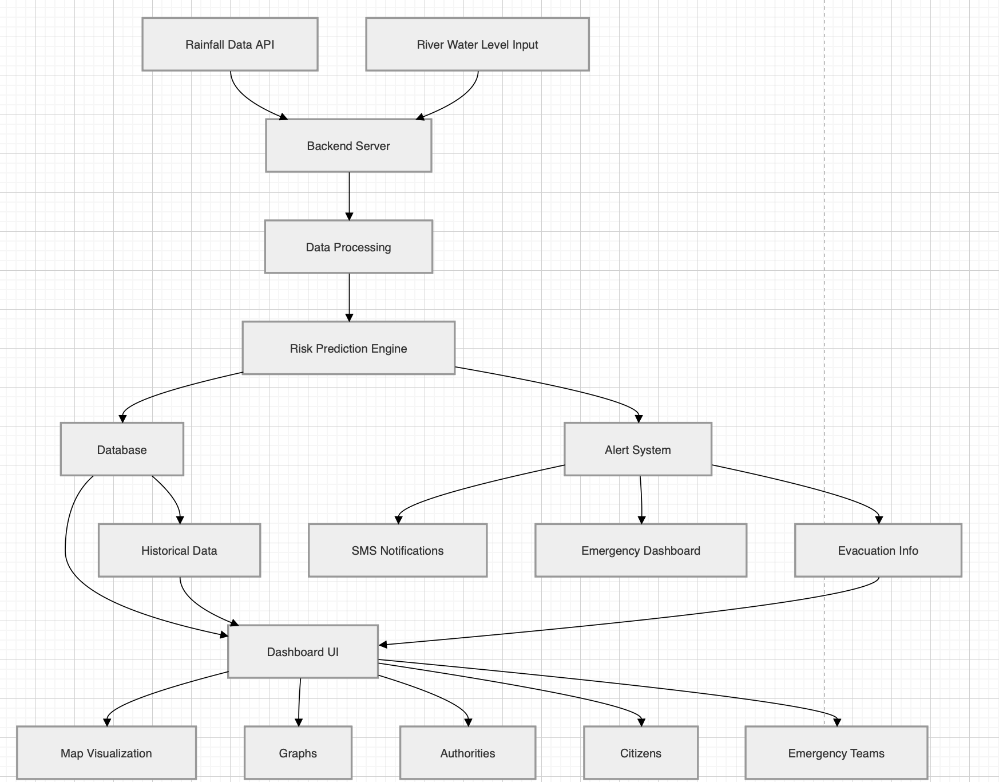

# System Architecture

## Architecture Diagram

## Description

The system consists of the following components:

- Rainfall Data API and River Water Level Input provide real-time data
- Backend Server handles incoming data
- Data Processing module cleans and prepares data
- Risk Prediction Engine calculates flood risk levels

## Outputs

- Alert System generates warnings
- SMS Notifications send alerts to users
- Emergency Dashboard helps authorities monitor situations
- Evacuation Info supports safe movement of citizens

## Data Storage

- Database stores all data
- Historical Data is used for future analysis

## User Interface

- Dashboard UI displays all information
- Includes:
  - Map Visualization
  - Graphs
  - Access for Authorities, Citizens, and Emergency Teams
